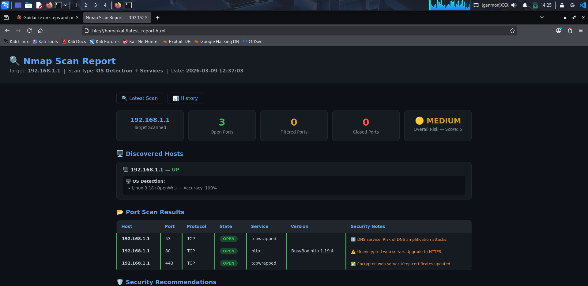
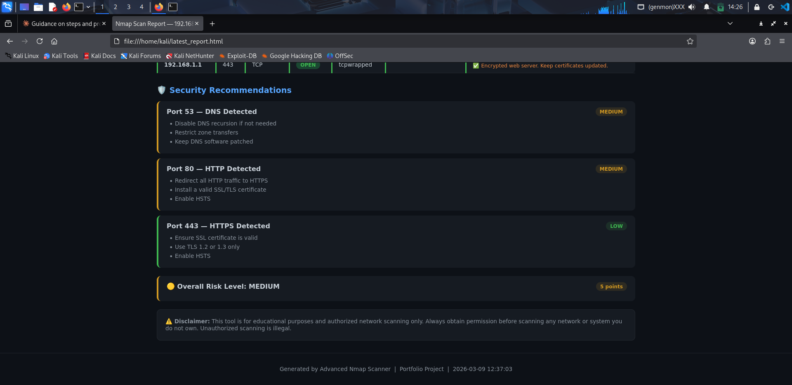
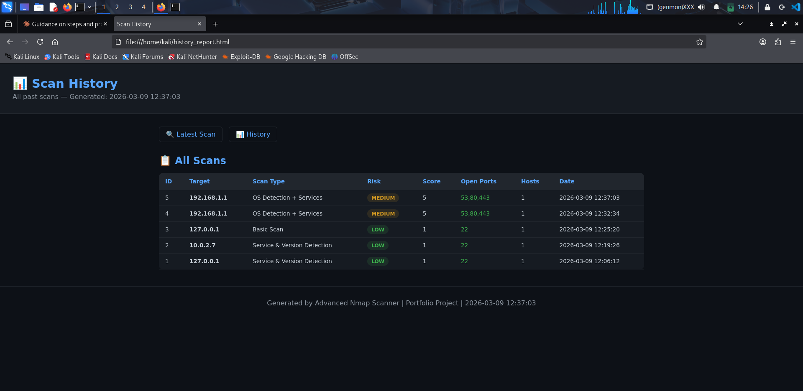

# 🔍 Advanced Nmap Network Scanner

A professional Python-based network scanning and security assessment tool built on top of Nmap.
Designed for security professionals, students, and anyone preparing for a cybersecurity career.

---

## 📸 Screenshots

### Terminal Output


### HTML Report


### Scan History


---

## 🚀 Features

- 🖥️ Single IP, Multiple IPs, and Subnet scanning
- 🌐 Network Sweep — find all live hosts in a subnet automatically
- 🔎 Service & Version Detection
- 🧠 OS Detection
- ⚠️ Automatic Vulnerability Hints for dangerous open ports
- 🛡️ Security Recommendations per open port
- 📊 Overall Risk Scoring (LOW / MEDIUM / HIGH / CRITICAL)
- 🔬 Real CVE Lookup from National Vulnerability Database (NVD)
- 🎨 Colorful terminal output
- 📄 Auto-saves TXT report per scan
- 🌐 Generates dark-themed HTML report (auto-refreshes every 30s)
- 📋 JSON export for integration with other tools
- 📁 Organized report folders (txt / html / json)
- 📊 Scan History Database — track all past scans
- 🔍 Search scan history by IP address

---

## 🛠️ Built With

- Python 3
- [Nmap](https://nmap.org/)
- [python-nmap](https://pypi.org/project/python-nmap/)
- [colorama](https://pypi.org/project/colorama/)
- SQLite3 — scan history database
- NVD CVE API (https://nvd.nist.gov/)

---

## ⚙️ Installation

### 1. Clone the repository
```bash
git clone https://github.com/YOURUSERNAME/nmap-scanner.git
cd nmap-scanner
```

### 2. Install Nmap
```bash
sudo apt install nmap
```

### 3. Install Python dependencies
```bash
pip3 install -r requirements.txt --break-system-packages
```

---

## ▶️ Usage
```bash
sudo python3 scanner.py
```

Follow the prompts:

**Main Menu:**
```
[1] Run new scan
[2] View scan history
[3] Exit
```

**Target Types:**
```
[1] Single IP          (e.g. 192.168.1.1)
[2] Multiple IPs       (e.g. 192.168.1.1,192.168.1.2)
[3] Subnet / Range     (e.g. 192.168.1.0/24)
[4] Network Sweep      (find all live hosts first)
```

**Scan Types:**
```
[1] Basic Scan (fast)
[2] Service & Version Detection
[3] OS Detection + Services (most detailed)
```

---

## 📊 Output Example
```
============================================================
        🔍 ADVANCED NMAP NETWORK SCANNER TOOL
============================================================
🖥️  Host     : 192.168.1.1
🌐 Hostname : router.local
📡 State    : up
📂 Protocol : TCP
--------------------------------------------------
  ✅ Port    80 | open   | http    | BusyBox http 1.19.4
           └─ ⚠️  Unencrypted web server. Upgrade to HTTPS.

  🔎 CVE Lookup — Port 80 (http)
  🔴 CVE-2000-1168 [HIGH]
  🟡 CVE-1999-1412 [MEDIUM]

============================================================
  🛡️  SECURITY RECOMMENDATIONS
============================================================
🟡 Port 80 — HTTP Web Server Detected
   Risk Level: MEDIUM
     → Redirect all HTTP traffic to HTTPS immediately
     → Install a valid SSL/TLS certificate
     → Enable HTTP Strict Transport Security (HSTS)

  🟡 OVERALL RISK LEVEL: MEDIUM
  📊 Risk Score: 5 points
============================================================
```

---

## 📁 Project Structure
```
nmap-scanner/
├── scanner.py          # Main scanner — entry point
├── report.py           # HTML report generator
├── recommendations.py  # Security recommendations & risk scoring
├── cve_lookup.py       # CVE lookup from NVD database
├── sweep.py            # Network sweep / ping sweep
├── history.py          # Scan history database (SQLite)
├── colors.py           # Terminal color utilities
├── requirements.txt    # Python dependencies
├── .gitignore          # Git ignore rules
├── screenshots/        # Project screenshots
└── reports/
    ├── txt/            # Text reports (timestamped)
    ├── html/           # HTML reports (latest_report.html)
    └── json/           # JSON exports (timestamped)
```

---

## ⚠️ Disclaimer

This tool is for **educational purposes** and **authorized network scanning only**.
Always obtain permission before scanning any network or system you do not own.
Unauthorized scanning is **illegal** and unethical.

---

## 👤 Author

**Param**
[LinkedIn](www.linkedin.com/in/paramjeetkaurpk123) | [GitHub](https://github.com/Param385)
